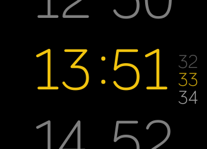
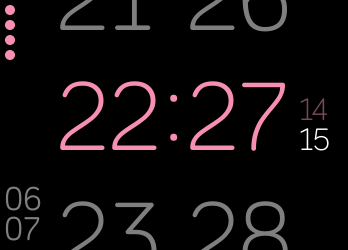
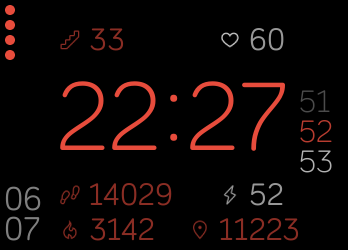
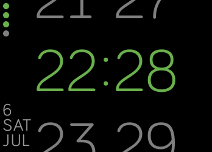
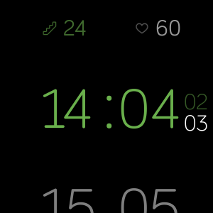
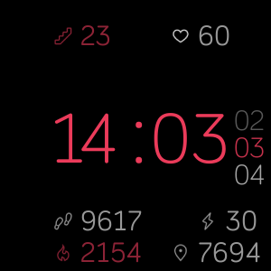
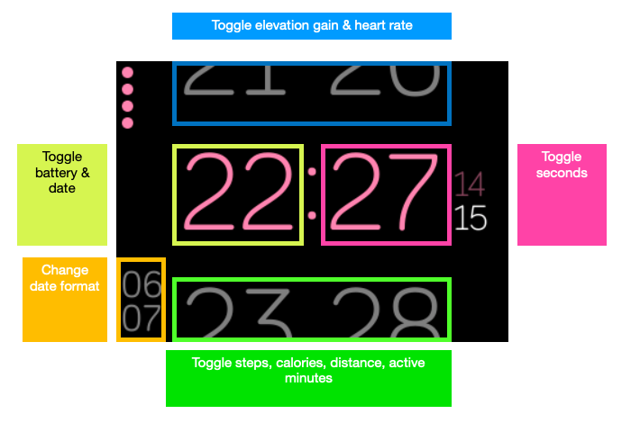

# alarms-fitbit

A Fitbit clock face looking like the Alarms app.

## Features

It can be very minimalistic with only hours & minutes displayed or you can have seconds & activities.

Available activities:

* Steps
* Calories
* Active Minutes
* Distance
* Heart Rate
* Elevation Gain

You can display the date in two formats:

* Day number / Day / Month
* Day number / Month number

## Devices

This clock face is compatible with:

* Ionic
* Versa
* Versa Lite

## Screenshots

| Ionic | Ionic again |
|----------|:-------------:|
|  |  |
|  |  |

| Versa | ... |
|-------|------|
|  |  |

## Help

The action zones that trigger changes in the user interface:

## Support

You can support this app by donating [via Paypal](https://www.paypal.me/rootasjey).

## Contributing

Feel free to contribute to this project by:

* Opening a PR to propose a change
* Openning an issue if you encounter a bug or want to ask a question

## Licence

MIT Licence
